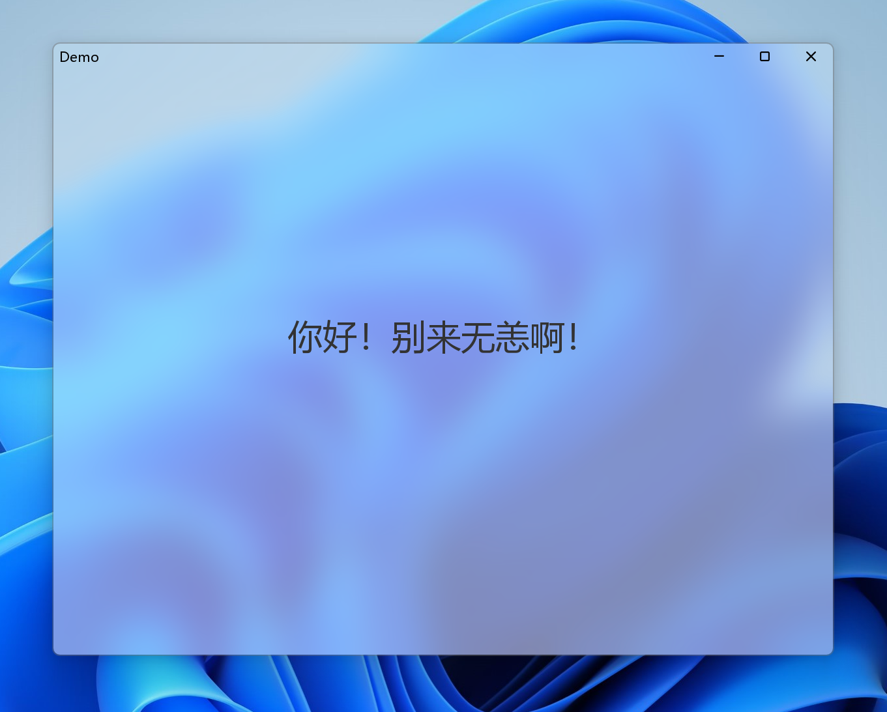

# 警告
此方案牺牲了JFrame的跨平台性，而且性能较低下，请勿用于生产环境，仅供参考

# Readme.md
en [English 英文](README.en.md)

# 展示

# 介绍
这是一个带有Win11云母效果的JFrame，demo.java说明如何使用

使用JNA第三方库实现

JNA负责调用WindowsAPI来实现云母效果，接口继承Library，用`SetWindowCompositionAttribute`方法实现
